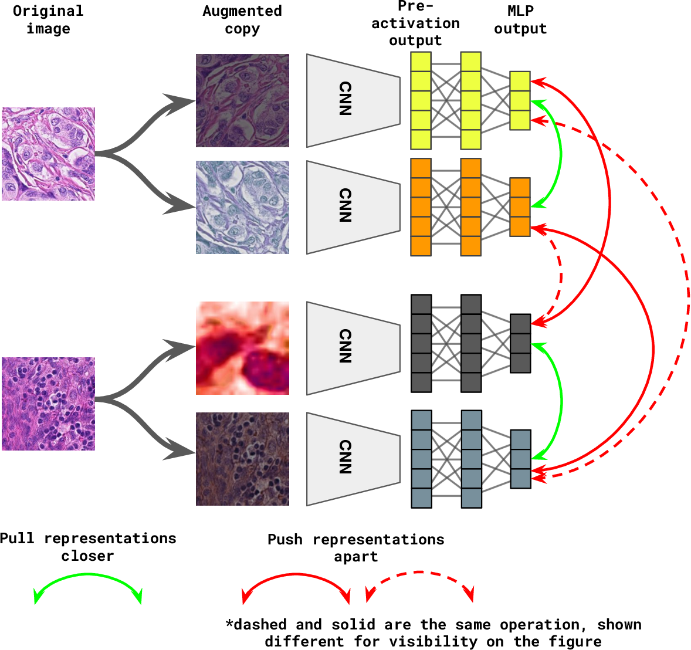

# shopee-product-matching

Implementaion of [Kaggle Competition](https://www.kaggle.com/c/shopee-product-matching)

## Problem Definition

Retrieve same product using given images and texts per each product(below are examples)

## How to solve

### train dataset analysis 
- 34250 image & text information
- total 11014 label_group(classes)
- 2 ~ 51 same class instance num( class imbalance)
- It's **hard to solve as Classification model!**

### Using Metric Learning

Basic Concept

Feature Extraction from two images

- It can just few examples in one mini-batch(calculate mini-batch size times) -> how to get more pair features?

Using in-batch constrastive loss

- It calculate all relations in one mini-batch(calculate mini-batch size * mini-batch size times)

## To-do

## References
